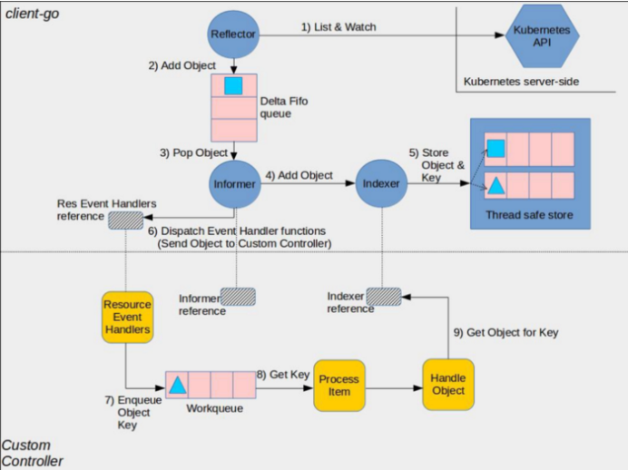

# Kyma-Watcher (PoC)

> Modify the title and insert the name of your project. Use Heading 1 (H1).

## Overview

Kyma is the opinionated set of Kubernetes based modular building blocks that includes the necessary capabilities to develop and run enterprise-grade cloud-native applications. This repository is the PoC (proof of Concept) for the `Kyma Watcher` (short: `Watcher`). The Watcher is an operator watching for events (`ADDED`, `DELETED`, `MODIFIED`) of ConfigMaps inside a Kyma-Cluster in specific namespaces. The observed events will then be processed and communicated to {...}.
TODO

### GitHub Issues
- [MVP](https://github.com/kyma-project/kyma-operator/issues/33)
- [PoC](https://github.com/kyma-project/kyma-operator/issues/10)
## Prerequisites

- Go 1.18
- Running Kubernetes cluster

## Watcher

[watch.Interface.ResultChan()](https://pkg.go.dev/k8s.io/apimachinery/pkg/watch#Interface):
- Only after-state of resource
- Fits for lower level problems

[chache.NewINformer()](https://godoc.org/k8s.io/client-go/tools/cache#NewInformer):
- client-side caching mechanism (simple cache or FIFO)
- Reducing the number of server calls you'd otherwise need to make
- Before- and after-state of resource
- Build on top of watch interface
- Higher level of abstraction
- Consists of a watcher, a lister and an in-memory cache
- SharedInformers share the connection with the API server and other resources between your informers
- Retries APIrequest if it fails or if pods restarts
- SharedIndexInformers add an index to your data cache, in case you work with a larger dataset

### Informer Pattern
[link](https://medium.com/codex/explore-client-go-informer-patterns-4415bb5f1fbd)

    
    <em>https://miro.medium.com/max/700/0*-8qgvqK279Tbm-ci</em>

## Usage

> Explain how to use the project. You can create multiple subsections (H3). Include the instructions or provide links to the related documentation.

## Development

> Add instructions on how to develop the project or example. It must be clear what to do and, for example, how to trigger the tests so that other contributors know how to make their pull requests acceptable. Include the instructions or provide links to related documentation.

## Troubleshooting

> List potential issues and provide tips on how to avoid or solve them. To structure the content, use the following sections:
>
> - **Symptom**
> - **Cause**
> - **Remedy**
